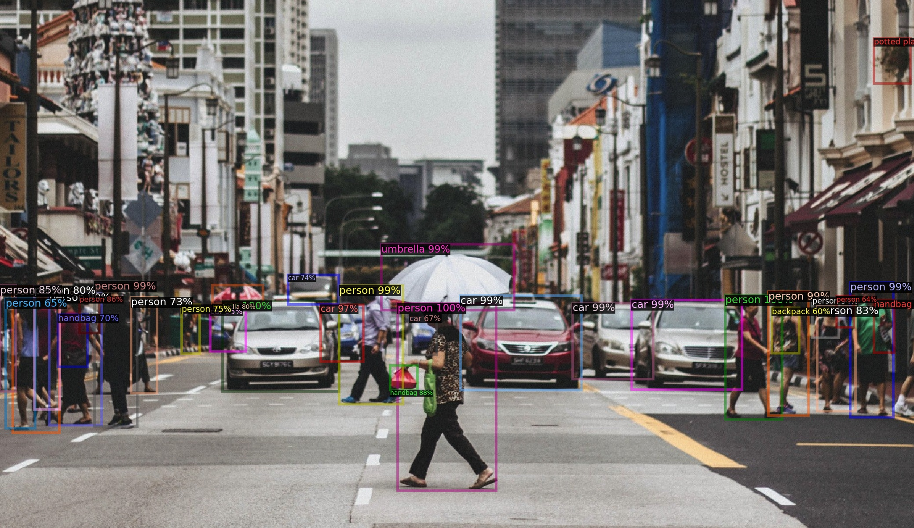

# Object Detection with Detectron2
This project is a simple demonstration of object detection using Detectron2, a popular deep learning framework for object detection and segmentation. The project uses the Faster R-CNN with ResNet-101 FPN model trained on the COCO dataset for object detection.    


## Requirements
- Python 3.x
- OpenCV
- PyTorch
- Detectron2
   
## Installation
1. Clone the repository to your local machine.
2. Clone the Detectron2 repository by running the following command:   
``` git clone https://github.com/facebookresearch/detectron2.git ```
3. Install the required packages by running the following command:   
``` python -m pip install -r requirements.txt ```
4. Install Detectron2 by running the following command:   
```python -m pip install -e detectron2```
   
## Usage
1. Place the image file(s) you want to test in the root directory of the project.
2. Open the object_detection.py file in a text editor and modify the imread variable to the path of your input image(s).
3. Run the object_detection.py script using the command `python simple_object_detection.py`.
4. The output image(s) will be saved in the output directory.
   
## Notes
- The project currently supports only images, but the code can be modified to support videos as well.
- The project uses a pre-trained model, but Detectron2 provides the capability to train your own custom models on your own datasets.
- For more information on Detectron2, please refer to the [official documentation](https://detectron2.readthedocs.io/en/latest/index.html).
   
## References:
- https://gilberttanner.com/blog/detectron-2-object-detection-with-pytorch/   